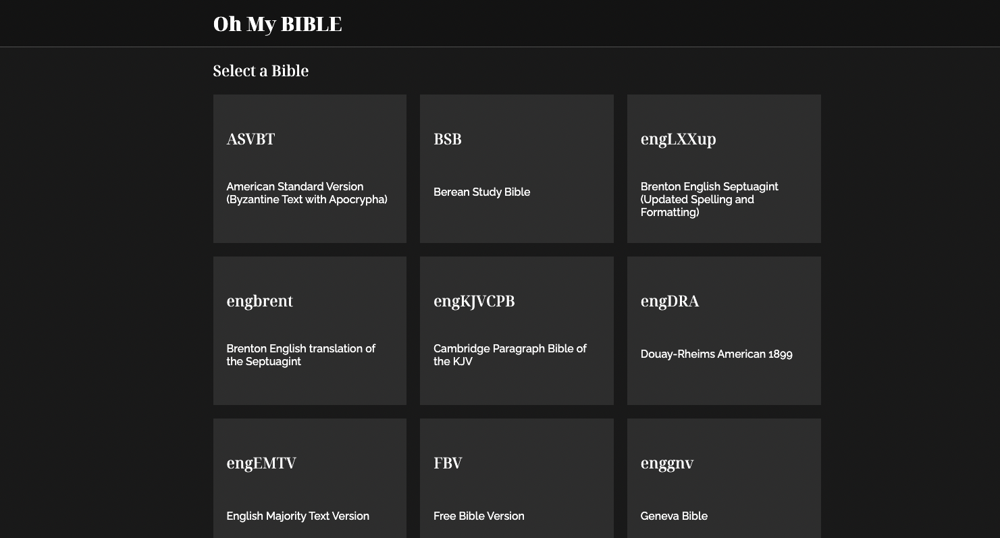
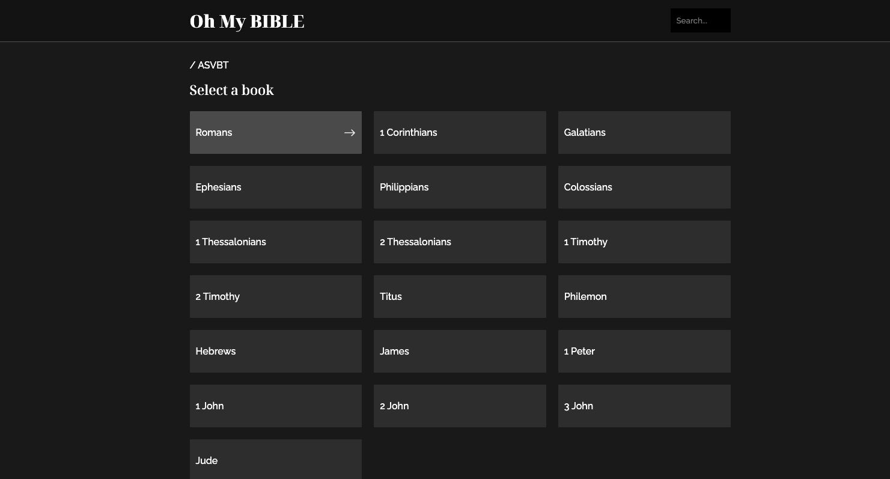
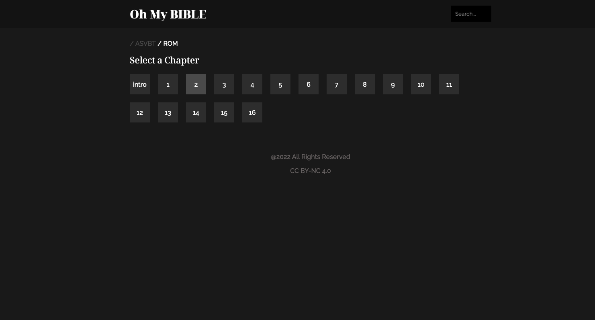
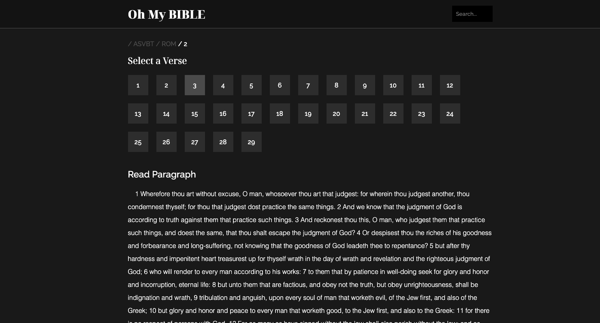
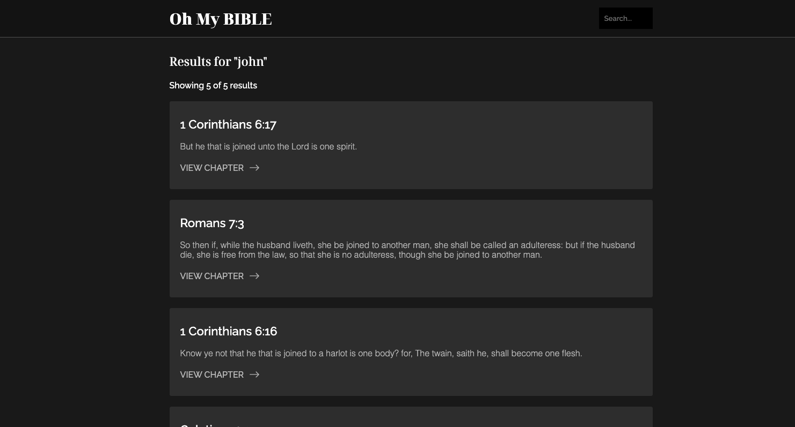

# OH MY BIBLE

Demo Site: https://ohmybible.herokuapp.com/

## Tech Stack
Front End: JavaScript, HTML/CSS, SASS

Back End: NodeJS, ExpressJS, EJS

Testing: Jest

API:
[**Bible Api**](https://docs.api.bible/tutorials/verse-of-the-day)

## Installation
1. **Run** `npm install` to install all dependencies

2. **Run** `npm start` to launch the project `port listening to 5000`, be sure the port is avaliable

3. **Run** `npm test` to run jest tests

## Features

### Pick a Bible Version

### Pick a Book

### Pick a Chapter

### Pick a Verse

### Search Relevent Chapters (Pagination)

## References
https://labs.bible.org/NETBibleTagger

https://github.com/openbibleinfo/Bible-Passage-Reference-Parser/blob/master/src/ascii/book_names.txt